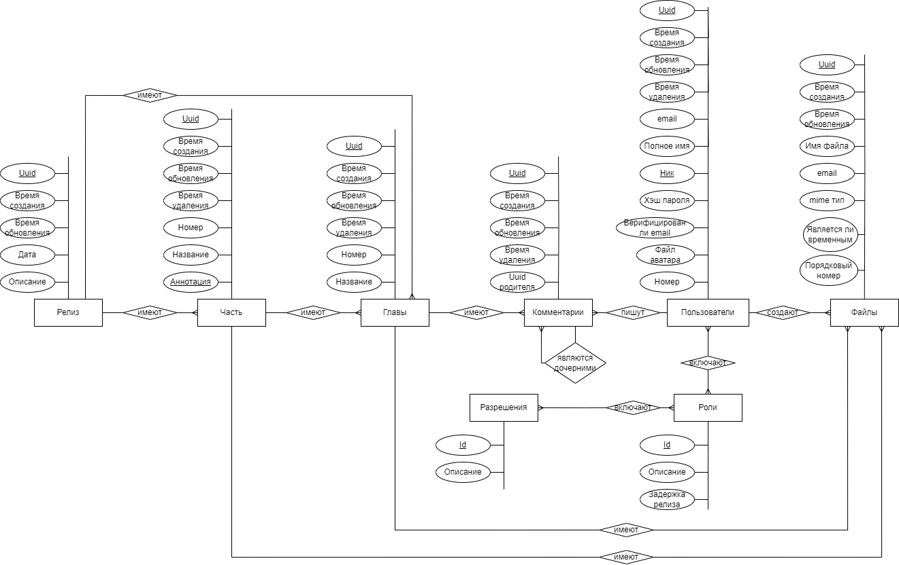
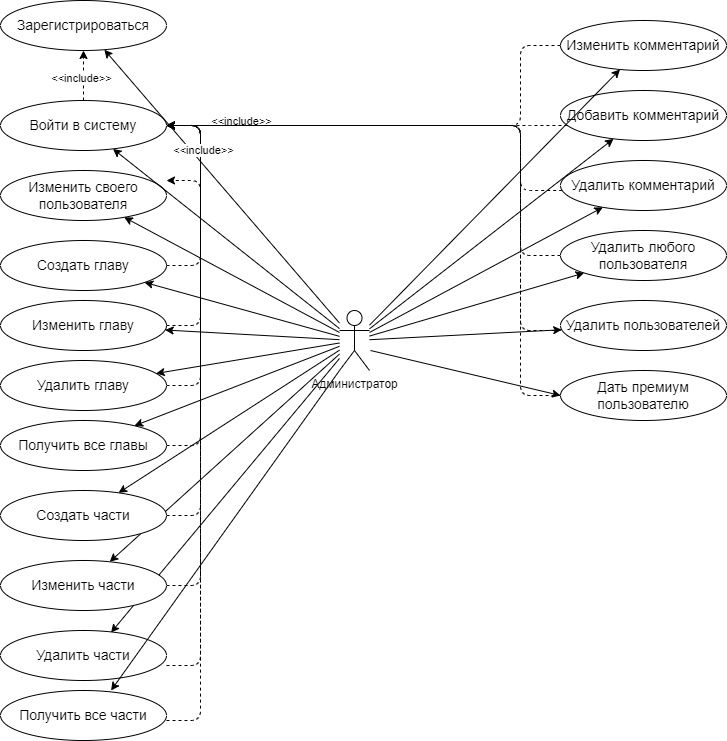
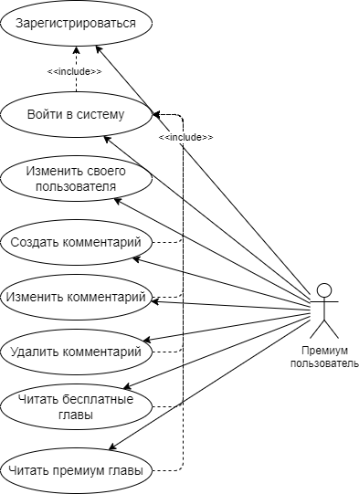
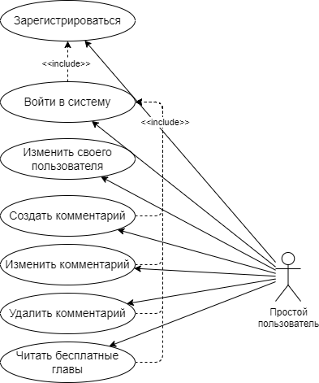
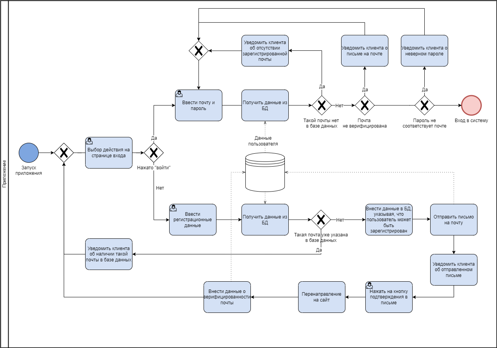
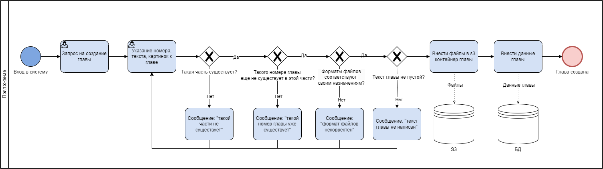

# Cервис чтения и обсуждения книги

---

## Краткое описание идеи проекта

Разработка приложения, представляющего собой сервис обсуждения и чтения книги. Есть необходимость авторизации для оставления комментариев, нет такой необходимости для чтения. Премиум пользователь может читать главы, которые будут доступны бесплатному пользователю через месяц. Администратор может добавлять и удалять главы, добавлять и удалять комментарии любого пользователя, а также давать премиум аккаунт любому пользователю, отнимать у него права на премиум доступ, а также удалять пользователя.

## Краткое описание предметной области

Описанное приложение предоставляет возможность читателям читать произведение и комментировать его. Автору – выпускать, редактировать и удалять главы, писать комментарии, удалять пользователей, а также выдавать им премиум доступ. В зависимости от степени доступа пользователя, пользователь может просматривать больше или меньше глав. В приложении хранится лишь одна книга. 

## Краткий анализ аналогичных решений

| Название приложения | Возможность  комментировать | Возможность удалять комментарии (для автора) | Индивидуализм (одна книга на сайте) | Возможность дать премиум пользователю без платы | Механизм доступности глав в зависимости от типа пользователя | Механизм бана (удаления с сайта) неугодных читателей | Возможность создавать циклы книг (части) |
| :------------------ | --------------------------- | -------------------------------------------- | ----------------------------------- | ----------------------------------------------- | ------------------------------------------------------------ | ---------------------------------------------------- | ---------------------------------------- |
| Фикбук              | +                           | +                                            | -                                   | -                                               | -                                                            | -                                                    | -                                        |
| Ватпад              | +                           | -                                            | -                                   | -                                               | -                                                            | -                                                    | -                                        |
| Автор.Тудей         | +/-                         | -                                            | -                                   | -                                               | -                                                            | -                                                    | +                                        |
|                     |                             |                                              |                                     |                                                 |                                                              |                                                      |                                          |

## Краткое обоснование целесообразности и актуальности проекта

Актуально для писателей, которые хотят иметь собственный сайт лишь со своим произведением. В связи с этим актуально приложение, которое способно как на поддержку стандартных функций (разные виды пользователей, комментирования), так и на уникальные возможности. Например, ни на одном из рассмотренных ресурсов нет механизма различной доступности глав в зависимости от времени публикации и  типа пользователя (премиум или бесплатный), помимо этого на них нет возможности банить неугодных читателей. 

## Роли

Администратор (писатель), бесплатный пользователь и премиум пользователь.

## ER-диаграмма сущностей

## Use-Case

Очистка временных файлов происходит автоматически через 12 часов.

## Пользовательские сценарии

Администратор

1. Авторизоваться
2. Добавить часть 
3. Редактировать часть
4. Добавить главу к части
5. Редактировать главу к части
6. Добавить комментарий к главе
7. Изменить комментарий к главе
8. Удалить комментарий к главе
9. Удалить главу к части
10. Удалить часть
11. Дать пользователю премиум доступ
12. Убрать у пользователя премиум доступ
14. Удалить пользователя

Бесплатный пользователь

1. Регистрироваться
2. Авторизоваться
3. Прочитать бесплатную главу
4. Добавить комментарий
5. Редактировать комментарий
6. Удалить комментарий

Платный пользователь

1. Регистрироваться
2. Авторизоваться
3. Прочитать бесплатную главу
4. Добавить комментарий
5. Редактировать комментарий
6. Удалить комментарий
7. Прочитать платную главу 
8. Добавить комментарий к платной главе
9. Редактировать комментарий к платной главе
10. Удалить комментарий к платной главе

## Формализация бизнес-правил

Ниже приведена формализация нескольких основных бизнес-правил.

